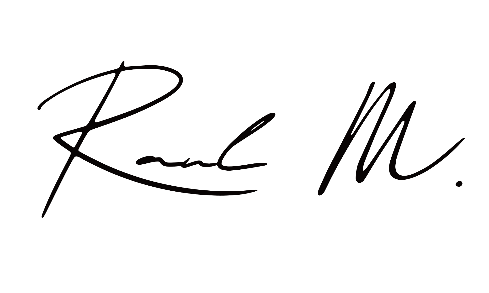

## Hey, I'm Raul.

I build data/ML projects, web apps, blockchain & cryptography systems, and occasionally play with Swift.

I care about solid architecture, readable code, and not shipping fragile systems.  
Most of what’s here is small tools, experiments, and prototypes around privacy, security, and getting ideas into production.

🔗 Check out more of my work at my [portfolio site](https://raulmalik.com).

<picture>
  <source media="(prefers-color-scheme: dark)" srcset="trace-white.svg">
  <source media="(prefers-color-scheme: light)" srcset="trace.svg">
  
</picture>
